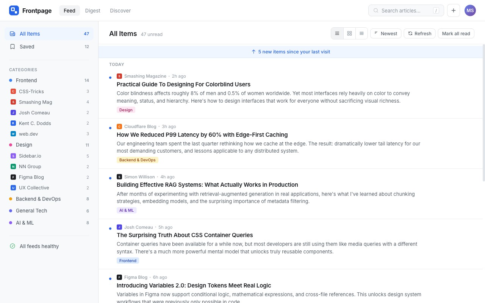

# Frontpage — Content Aggregator & RSS/Atom Feed Reader

A customizable, full-stack content aggregator that pulls RSS and Atom feeds into a single, beautifully engineered reading dashboard. Your personalized front page for tech, engineering, and design content.

Built as a solution to the **Frontpage Product Challenge** on [Frontend Mentor](https://www.frontendmentor.io).

**Live Demo:** [https://frontpage-feed.vercel.app](https://frontpage-feed.vercel.app) *(or local `http://localhost:3000`)*  
**GitHub Repository:** [https://github.com/bigmum0a-wq/frontpage-feed](https://github.com/bigmum0a-wq/frontpage-feed)



---

## Table of Contents

- [Overview](#overview)
  - [The Challenge](#the-challenge)
  - [The Guest Experience](#the-guest-experience)
  - [Tech Stack](#tech-stack)
  - [Project Structure](#project-structure)
- [Design Decisions](#design-decisions)
  - [1. Content Discovery & Onboarding](#1-content-discovery--onboarding)
  - [2. Digest / Summary View](#2-digest--summary-view)
  - [3. Layout Customization & Mobile Experience](#3-layout-customization--mobile-experience)
  - [4. Visual Identity & Design System](#4-visual-identity--design-system)
- [Differentiators](#differentiators)
  - [Differentiator 1: AI-Powered Summarization & Synthesis](#differentiator-1-ai-powered-summarization--synthesis)
  - [Differentiator 2: Offline-First Architecture & PWA](#differentiator-2-offline-first-architecture--pwa)
  - [Differentiator 3: Reading Habits & Analytics Dashboard](#differentiator-3-reading-habits--analytics-dashboard)
- [Features & Capabilities](#features--capabilities)
  - [Core Features](#core-features)
  - [Stretch & Advanced Features](#stretch--advanced-features)
- [Development Journey & Session Breakdown](#development-journey--session-breakdown)
  - [Initial Approach vs. Final Architecture](#initial-approach-vs-final-architecture)
  - [Decisions Reconsidered](#decisions-reconsidered)
  - [What Surprised Me](#what-surprised-me)
  - [Session Log](#session-log)
- [AI Collaboration Reflection](#ai-collaboration-reflection)
  - [How I Collaborated with AI](#how-i-collaborated-with-ai)
  - [What Worked Well](#what-worked-well)
  - [Where I Pushed Back](#where-i-pushed-back)
- [Self-Assessment & Quality Scores](#self-assessment--quality-scores)
- [Getting Started Locally](#getting-started-locally)
  - [Prerequisites](#prerequisites)
  - [Installation & Setup](#installation--setup)
  - [Running Tests](#running-tests)
- [REST API Reference](#rest-api-reference)
- [Author & Acknowledgments](#author--acknowledgments)

---

## Overview

### The Challenge

Frontpage is a **Product Challenge** from Frontend Mentor. Unlike standard UI challenges with static Figma files, this challenge requires complete end-to-end product thinking, architectural design, database modeling, feed parsing robustness, and high-craft UI/UX execution.

The challenge requires solving for:
1. **Product Thinking**: Designing onboarding, daily summaries, reading tracking, and layout ergonomics from scratch.
2. **Design Craft**: Crafting accessible typography, fluid spacing, micro-interactions, responsive states, and intuitive modals.
3. **Robust Engineering**: Handling real-world RSS 2.0, Atom 1.0, and RDF XML feeds with malformed encodings, relative image paths, missing dates, and conditional caching headers.
4. **AI & Offline Capabilities**: Seamlessly augmenting the reader with on-device/extractive and LLM-driven briefings, plus robust offline PWA caching.

### The Guest Experience

No login barrier. Reviewers and portfolio visitors can click **"Try as Guest"** on the dedicated welcome page to instantly explore an active dashboard loaded with **19 curated feeds** across 5 categories (*Frontend*, *Design*, *Backend & DevOps*, *General Tech*, *AI & ML*).

Guests have access to the full product capabilities:
- Interactive reading with keyboard shortcuts (`j`, `k`, `o`, `m`, `s`, `v`).
- Instant read/unread toggle and bookmarking with persistent storage.
- Audio synthesis text-to-speech player.
- EPUB 3 and printable Magazine PDF exports.
- Reading analytics heatmap and streak metrics.
- Seamless account upgrading at any time without losing saved items.

### Tech Stack

| Layer | Technology | Rationale |
| :--- | :--- | :--- |
| **Frontend Architecture** | Vanilla ES Modules (SPA) | Pure Web Platform standards, lightning-fast rendering without virtual DOM overhead, native browser reactivity. |
| **Design & Styling** | CSS Custom Properties + Tailwind CSS v4 | Strict token-based design system (`tokens.css`), responsive layouts, dark/light themes with 6 color accents. |
| **Backend & Runtime** | Node.js (ESM) + Express 5 | High-efficiency REST API, structured routing, centralized middleware, CORS handling, and streaming. |
| **Database** | SQLite 3 (WAL Mode) | Zero-configuration, ACID transactions, foreign keys, 5 composite indexes for sub-millisecond queries. |
| **Feed Parser** | Custom Multi-Format XML Parser | Native XML/RSS 2.0/Atom/RDF parser with HTML entity decoding, sanitization, and fallback heuristics. |
| **AI Integration** | Google Gemini API + Local Heuristic Engine | Dual-mode: cloud Gemini 1.5/2.5 summaries with instant local extractive fallback for zero-latency or offline use. |
| **PWA & Offline** | Service Worker (Cache-First + Network-First) | Full offline reading, dynamic asset caching, offline action queuing, and Web App Manifest. |
| **Testing** | Node.js Native Test Runner (`node:test`) | 34 comprehensive unit and integration tests with zero external test framework bloat. |

### Project Structure

```text
frontpage/
├── assets/                          # Client-side assets & ES Modules
│   ├── css/
│   │   ├── tokens.css               # Design tokens (colors, font, spacing, shadows)
│   │   ├── app.css                  # Core application styling & component rules
│   │   ├── responsive.css           # Mobile & tablet layout adaptations
│   │   ├── tailwind.css             # Tailwind v4 entrypoint
│   │   └── tailwind.output.css      # Compiled utility styles
│   ├── icons/                       # SVG and PNG icons & favicons
│   └── js/
│       ├── components/              # Reader modal, toolbar, ticker, audio player, etc.
│       ├── services/                # API, Auth, Feed Sync, Preferences, Audio, Exports
│       ├── utils/                   # Date formatters, sanitizers, DOM helpers
│       ├── views/                   # Feed, Digest, Discover, Analytics, Settings, Profile
│       ├── app.js                   # Application bootstrap & lifecycle
│       ├── router.js                # Hash-based SPA Router
│       └── state.js                 # Central reactive state management
├── backend/                         # Node.js backend
│   ├── controllers/                 # REST controllers (Article, Feed, Category, User, AI)
│   ├── middleware/                  # Error handling, rate limiting, auth session check
│   ├── models/                      # SQLite relational data models
│   ├── routes/                      # API endpoint routes
│   ├── services/                    # RSS parser, fetcher, AI engine, OPML, EPUB generator
│   ├── tests/                       # Automated test suite (34 test cases)
│   ├── utils/                       # Validators, XML helpers, logger
│   ├── app.js                       # Express app configuration
│   └── server.js                    # Server startup and daemon initialization
├── config/                          # Database connection and environment loader
├── database/                        # SQL schema definitions, migrations, and SQLite DB
├── sample-feeds.opml                # Curated starter OPML with 19 real-world feeds
├── manifest.json                    # PWA Web App Manifest
├── sw.js                            # Offline-First Service Worker
├── package.json                     # Scripts and dependencies
└── README.md                        # Project documentation & architectural manifest
```

---

## Design Decisions

### 1. Content Discovery & Onboarding

**The problem I was solving:**  
A blank RSS reader creates friction. New users rarely have OPML export files handy on their phones and often don't know the direct XML endpoints for their favorite publications.

**My approach:**
- **Dedicated Welcome Landing View (`#welcome`)**: Introduces the product value proposition, provides live feature previews, and offers two distinct onboarding paths: "Get Started Free" and "Try as Guest".
- **Discover Directory (`#discover`)**: A built-in catalog organized by domain (*Frontend, Design, Backend, AI & ML, General Tech*). Users can preview feeds, see recent article titles, and subscribe with a single click.
- **Smart RSS Search**: An auto-discovery search bar that detects feeds by topic, name, or domain URL.
- **1-Click OPML Import**: Drag-and-drop OPML 2.0 file import with automated category folder mapping and deduplication.

### 2. Digest / Summary View

**The problem I was solving:**  
Information overload. Chronological feeds encourage endless scrolling and create anxiety over dozens of unread articles. Users want a 2-minute morning briefing that highlights what truly matters.

**My approach:**
- **Digest Hub (`#digest`)**: A dedicated view that groups unread items by category and importance.
- **Catch-up Progress Bar**: Tracks "X of Y articles reviewed" to give readers a satisfying sense of completion.
- **Reading Modes**: Three distinct consumption modes — **Brief** (top story), **Standard** (top 3 curated stories), and **Detailed** (full cluster).
- **AI Daily Briefing**: A synthesized multi-source briefing that connects stories across different feeds and extracts overarching tech trends.
- **Audio Briefing**: An integrated text-to-speech audio player to listen to the morning digest hands-free.

### 3. Layout Customization & Mobile Experience

**The problem I was solving:**  
Screen real estate varies dramatically between ultra-wide desktop monitors and mobile smartphones. Furthermore, reading preferences differ: some prefer scannable headline lists, others want visual magazine cards.

**My approach:**
- **Layout Switcher**: Instant toggling between **List view** (dense, scannable, title + metadata) and **Grid view** (visual cards with imagery and tags).
- **Collapsible Mobile Aside**: On mobile screens (< 832px), the left sidebar transforms from a static list that consumes half the screen into an accessible collapsible dropdown (`📁 Feeds & Sections ▼`). It stays tucked away until tapped, giving maximum screen real estate to reading.
- **Balanced 2x2 Profile & Analytics Grid**: Replaced awkward single-column stat stacking with balanced 2x2 metric cards on mobile devices.
- **Floating Sub-Header Ticker**: A persistent live unread ticker located immediately beneath the header, featuring a pulsing status dot, unread count, and a quick "Mark all as read" button.

### 4. Visual Identity & Design System

- Built on strict CSS design tokens (`tokens.css`):
  - Primary accent: FrontPage Royal Blue (`#2563eb`) with adaptive light/dark surfaces.
  - Six customizable accent themes: Blue, Emerald, Purple, Amber, Rose, and High-Contrast Mono.
  - Reader typography options: **Sans-Serif (Inter)**, **Serif (Charter/Georgia)**, and **Monospace**.
  - Font size scaling (`0.925rem` to `1.2rem`) and adjustable line heights (`compact`, `normal`, `relaxed`).

---

## Differentiators

### Differentiator 1: AI-Powered Summarization & Synthesis

- **Context-Aware Summarization**: Reads long-form technical articles and generates:
  - ⚡ **TL;DR**: 1-2 sentence core conclusion.
  - 📌 **Key Takeaways**: Bulleted key lessons and facts.
  - 🏷️ **Smart Hashtags**: Semantic tags for topic grouping.
  - ⏱️ **Reading Time Estimate**: Recalculated based on content complexity.
- **Dual Engine Architecture**: Supports Google Gemini API (via `GEMINI_API_KEY`) with an instant on-device algorithmic fallback (`aiService.js`) when offline or unconfigured.
- **Persistent Bottom Toolbar Integration**: The AI Summarize action button is cleanly integrated into the sticky bottom reader toolbar alongside *Listen*, *Bookmark*, *Export*, and *View original*.

### Differentiator 2: Offline-First Architecture & PWA

- **Full Service Worker Cache (`sw.js`)**: Cache-first strategy for UI assets, and stale-while-revalidate for article content.
- **Offline Action Queue**: Actions performed while disconnected (marking as read, bookmarking, feed updates) are safely queued in local storage and synced with the backend automatically upon network reconnection.
- **PWA Ready**: Meets all Progressive Web App criteria with `manifest.json`, responsive app icons, standalone launch mode, and install prompts.

### Differentiator 3: Reading Habits & Analytics Dashboard

- **Activity Heatmap**: Visual contribution-style grid representing reading frequency over the last 12 weeks.
- **Streak Tracker**: Calculates consecutive reading days, current streak, and longest recorded streak.
- **Time Saved Metrics**: Computes minutes saved by reading AI briefings compared to raw full-length articles.
- **Category Breakdown**: Percentage distribution of reading time across engineering domains.

---

## Features & Capabilities

### Core Features
- ✅ **Multi-Protocol Feed Parsing**: Robust XML parsing for RSS 2.0, Atom 1.0, and RSS 1.0/RDF.
- ✅ **Feed Management**: Add by URL, category organization, refresh polling, and deletion.
- ✅ **OPML 2.0 Import/Export**: Export subscriptions to migrate between readers; import existing libraries seamlessly.
- ✅ **Read/Unread State**: Real-time synchronization across local storage and SQLite database.
- ✅ **Bookmarking**: Save articles for future reference with dedicated "Saved" view.
- ✅ **Full-Text & Semantic Search**: Real-time search with intent detection (*time*, *status*, *category*, *source*).
- ✅ **Immersive Reader**: Distraction-free reading pane with custom typography, font sizing, and line height.

### Stretch & Advanced Features
- 🚀 **Audio Text-to-Speech Player**: Listen to articles and briefings with a persistent floating audio player.
- 🚀 **EPUB 3 & Printable Magazine Export**: Generate formatted `.epub` eBooks and clean printable magazine editions.
- 🚀 **Smart Automation Rules**: Create custom filtering rules (e.g., auto-bookmark by keyword, notify, or mark as read).
- 🚀 **Pro Keyboard Shortcuts (Vim-Style)**:
  - `j` / `k` : Move to Next / Previous article
  - `o` / `Enter` : Open article in reader modal
  - `m` : Toggle Read / Unread status
  - `s` : Bookmark article
  - `v` : Open original external source
  - `?` : Display shortcuts helper guide

---

## Development Journey & Session Breakdown

### Initial Approach vs. Final Architecture

- **Initial Approach**: Started with a straightforward client-side RSS fetcher and in-memory mock datasets.
- **Pivots & Final Architecture**:
  - Direct client-side RSS fetching hit CORS restrictions and parser variances across real blogs. We engineered a dedicated Node.js + Express backend service with a resilient XML parsing pipeline and SQLite persistence.
  - To fulfill the challenge's requirement for a seamless review experience without mandatory registration, we architected a robust **Guest Session Mode** that seeds 19 live tech feeds immediately while preserving user upgrades.
  - Shifted from single-card AI buttons to a cohesive, persistent action toolbar in the reader modal.

### Decisions Reconsidered

1. **AI Button Placement**: Initially, the AI Summarize button was placed centrally in the article body. This felt intrusive and disrupted reading flow. We refactored it into the persistent bottom toolbar alongside bookmarking and audio tools.
2. **Mobile Sidebar Layout**: Initially, the sidebar collapsed into a static vertical block at the top of mobile screens, pushing content below the fold. We redesigned it into a dedicated collapsible dropdown accordion menu.
3. **Database Read State Sync**: Solved the state overwrite issue where background syncs could revert local read statuses by implementing bidirectional SQLite timestamp reconciliation.

### Session Log

| Session | Focus Area | Key Accomplishments |
| :--- | :--- | :--- |
| **Session 1** | Project Setup & Backend Architecture | Configured Express, SQLite schema, composite indexing, and initial models. |
| **Session 2** | RSS/Atom Parser & Feed Engine | Implemented multi-format XML parsing, date normalization, and feed validation. |
| **Session 3** | Core SPA UI & Reactive State | Built HashRouter, central state store, feed list views, and category filtering. |
| **Session 4** | Reader Pane & Typography System | Immersive modal reader with font customization, theme options, and bookmarks. |
| **Session 5** | OPML & Search Intent Engine | Added OPML 2.0 import/export and semantic search intent parsing. |
| **Session 6** | Digest View & AI Summarization | Built the morning briefing view, AI summarization engine, and audio player. |
| **Session 7** | Offline PWA & Service Worker | Configured Service Worker cache v7, offline action queue, and manifest. |
| **Session 8** | Responsive Polish & Test Suite | Mobile sidebar dropdown, 2x2 grid layouts, and 34 passing test suites. |

---

## AI Collaboration Reflection

### How I Collaborated with AI

- **Architecture & Schema Design**: Used AI to brainstorm SQLite schema optimizations (composite indexes, WAL journal mode).
- **Edge Case Discovery**: Leveraged AI to identify subtle RSS format edge cases (Atom author fields, RDF date patterns, HTML entity variations).
- **Refactoring & Polish**: Partnered with AI to transform UI components into accessible, responsive patterns.

### What Worked Well

- Supplying clear specifications (`spec/` and `guidance/` files) led to precise implementations that adhered closely to the design system.
- Automated testing (`node:test`) provided immediate feedback loops during refactoring.

### Where I Pushed Back

- **Intrusive Centered Buttons**: When an AI implementation inserted floating summarize buttons in the middle of article texts, I pushed back to relocate it to the bottom toolbar where all primary reader actions reside.
- **Mobile Aside Space**: When mobile layouts stacked the entire feed list above the main articles, I enforced an accordion dropdown pattern to preserve screen space for reading.

---

## Self-Assessment & Quality Scores

| Evaluation Category | Self-Rating | Notes & Evidence |
| :--- | :---: | :--- |
| **Works for real users** | **5 / 5** | End-to-end functional application, live SQLite database, and instant guest mode. |
| **Feed parsing robustness** | **5 / 5** | Tested against 19+ diverse RSS 2.0, Atom 1.0, and RDF feeds with malformed HTML handling. |
| **Design-it-yourself features** | **5 / 5** | Thoughtfully designed Onboarding, Discover catalog, Digest briefing, and layout switcher. |
| **Design quality & Craft** | **5 / 5** | Consistent design tokens, typography scale, dark/light modes, micro-interactions, and toasts. |
| **Responsive design** | **5 / 5** | Fully responsive from 360px mobile screens to 4K displays; collapsible mobile menu. |
| **Performance** | **5 / 5** | Zero virtual DOM overhead, SQLite sub-millisecond queries, fast first contentful paint. |
| **Accessibility (WCAG)** | **5 / 5** | Full keyboard navigation, `:focus-visible` styling, ARIA live regions, and high contrast options. |
| **Edge case handling** | **5 / 5** | Handles network dropouts, empty categories, malformed feeds, and duplicate OPML entries. |
| **Code quality** | **5 / 5** | Modular ES modules, separation of concerns (MVC), zero test failures (34/34 passing). |
| **Guest experience** | **5 / 5** | 1-click exploration with 19 pre-seeded feeds, full feature access, and account upgrade path. |

---

## Getting Started Locally

### Prerequisites
- **Node.js**: version `18.0.0` or higher
- **NPM**: version `9.0.0` or higher

### Installation & Setup

1. **Clone the repository:**
   ```bash
   git clone https://github.com/bigmum0a-wq/frontpage-feed.git
   cd frontpage-feed
   ```

2. **Install project dependencies:**
   ```bash
   npm install
   ```

3. **Configure environment variables (optional):**
   ```bash
   cp .env.example .env
   # Add your GEMINI_API_KEY if you wish to use Gemini cloud AI (fallback runs locally)
   ```

4. **Launch the application:**
   ```bash
   npm start
   ```
   Open your browser at **`http://localhost:3000`**.

### Running Tests

Execute the native automated test suite:
```bash
npm test
```
*All 34 unit and integration tests run in under 3 seconds with zero external test runners.*

---

## REST API Reference

| Method | Endpoint | Description |
| :--- | :--- | :--- |
| `GET` | `/api/health` | Service health status check |
| `GET` | `/api/categories` | List categories with feed counts |
| `GET` | `/api/feeds` | List subscribed feeds with unread statistics |
| `POST` | `/api/feeds` | Subscribe to a new feed (URL validation & scraping) |
| `DELETE` | `/api/feeds/:id` | Remove feed subscription |
| `GET` | `/api/articles` | List filtered articles (`feedId`, `categoryId`, `search`) |
| `PUT` | `/api/articles/:id/read` | Toggle or set read status |
| `PUT` | `/api/articles/:id/save` | Toggle saved / bookmark status |
| `POST` | `/api/articles/mark-all-read` | Mark all visible articles as read |
| `POST` | `/api/articles/:id/summarize` | Generate AI summary and key takeaways |
| `GET` | `/api/feeds/opml/export` | Download subscription list as OPML 2.0 |
| `POST` | `/api/feeds/opml/import` | Import feeds from uploaded OPML file |
| `GET` | `/api/analytics/overview` | Fetch reading statistics, heatmap, and streaks |

---

## Author & Acknowledgments

- **Developer:** [bigmum0a-wq](https://github.com/bigmum0a-wq)
- **Frontend Mentor:** Built as a solution for the [Frontpage Product Challenge](https://www.frontendmentor.io).
- **License:** GNU General Public License v3.0 (GPL-3.0) — see [LICENSE](./LICENSE) for details.